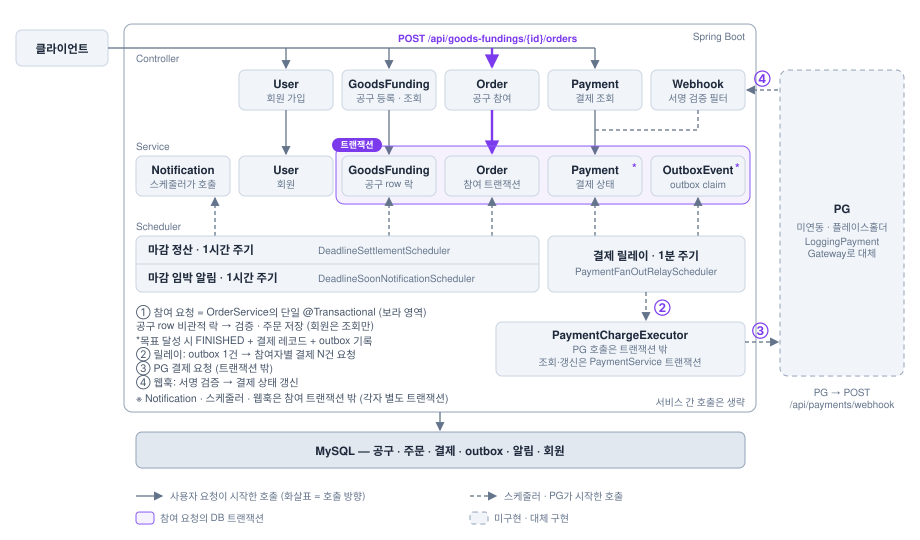
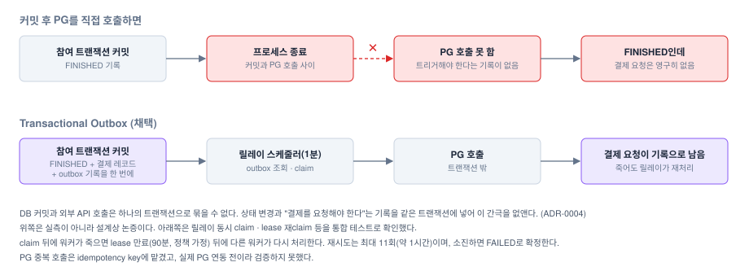

  

# GoodsUp — 팬덤 굿즈 공동구매·마감 임박 결제 백엔드

목표 수량을 채운 공구만 결제하고, 마감 직전에 요청이 몰려도 참여 수량이 목표를 넘지 않게 하는 서비스다.

Java 21 · Spring Boot 3 · MySQL · JUnit5 · Testcontainers

## 핵심 성과

- 동시 참여 200건(목표 수량 50)을 3회 반복해도 초과 판매 0건
- 같은 조건에서 락 전략을 비교한 결과, DB 비관적 락이 Redisson 락보다 TPS는 2.5배 높고 p99 지연은 3.8배 낮았다. (851 TPS · p99 148ms, 로컬 Docker, 서비스 메서드 직접 호출 기준)
- 마감 처리 스케줄러(미달 공구를 `FAILED`로 전이)를 10회 동시 호출해도 상태 전이는 1회, 알림 중복은 0건

| 전략 (ADR-0001) | 초과 판매 | TPS | p99 | 에러율 |
|---|---|---|---|---|
| Redisson RLock | 0건 | 334 | 565ms | 0% |
| **DB 비관적 락 (채택)** | **0건** | **851** | **148ms** | **0%** |
| 낙관적 락 + 재시도 | 0건 | 256 | 798ms | 9.83% |

동시 참여 200건, 목표 50 · 3회 평균 · 로컬 Docker MySQL 8.0 · 서비스 메서드를 `ExecutorService`로 직접 호출(HTTP 제외)

낙관적 락의 에러는 매진이 아니라, 재시도 10회 안에 버전 충돌을 풀지 못해 참여할 수 있었던 요청이 실패한 경우다.

| 마감 정산 (ADR-0002) | 정합성 (12회) | 테스트 실행 시간 |
|---|---|---|
| **단건 비관적 락 재사용 (채택)** | 통과 | **1.85초** |
| 벌크 UPDATE | 통과 | 16.2초 |

## 아키텍처

  

- 공구 상태: `RECRUITING` → `FINISHED`(마지막 한 자리 참여) 또는 `FAILED`(마감까지 목표 미달 → 1시간 주기 스케줄러가 전이)
- 참여: 공구 row 락 → 마감·수량·1인 한도 검증 → 주문 저장. 마지막 한 자리면 `FINISHED` 전이와 결제 레코드·outbox 기록을 같은 트랜잭션에 묶는다.
- 결제: Transactional Outbox 기반으로 스케줄러(1분 주기)가 outbox를 읽어 참여자별로 PG를 호출한다. PG 호출은 트랜잭션 밖이며, PG는 현재 대체 구현이다.
- 결과 반영: 승인(`SUCCESS`)은 그 자리에서, 실패는 재시도 후 확정하고, 대기(`PENDING`)는 웹훅으로 받아 각각 별도 트랜잭션에서 결제 상태를 갱신한다.

## 주요 기술적 결정

| 결정 | 선택 | 근거 |
|---|---|---|
| 참여 동시성 ([ADR-0001](docs/adr/0001-concurrency-control-strategy.md)) | DB 비관적 락 | 셋 다 초과 판매 0건, 처리량·지연 최고, Redis 불필요 |
| 마감 정산 ([ADR-0002](docs/adr/0002-deadline-settlement-batch-concurrency.md)) | 단건 락 재사용 | 정합성 동일, 벌크 UPDATE가 8~9배 느림(테스트 실행 시간 기준) |
| 결제 시점 ([ADR-0003](docs/adr/0003-payment-timing-strategy.md)) | 목표 달성 후 결제 | 미달 공구는 환불 자체가 없고, 참여 트랜잭션에서 PG 호출 안 함 |
| 결제 트리거 ([ADR-0004](docs/adr/0004-payment-fanout-trigger-strategy.md)) | Transactional Outbox + 폴링 | 정합성 테스트 통과, 신규 인프라 불필요. CDC는 PoC만 하고 보류 |

**왜 Outbox인가** ([ADR-0004](docs/adr/0004-payment-fanout-trigger-strategy.md))

  

트레이드오프는 각 ADR에 적었다. 요약하면 락 대기가 직렬이라 더 큰 규모는 확인하지 못했고, 결제 트리거 지연은 스케줄러 주기(1분)에 좌우된다.

## 트러블슈팅

락 로직을 구현할 때마다 Claude에게 깨뜨릴 시나리오를 제안받아 테스트로 검증했다. 재현된 문제는 수정하고 회귀 테스트로 고정했으며, 재현되지 않은 시나리오도 이유와 함께 로그에 남겼다. ([전체 로그](docs/experiments/adversarial-test-log.md))

- **결제 중복 호출**: lease가 만료돼 다른 워커가 같은 outbox row를 잡으면 PG를 두 번 호출했다. 완료 처리를 멱등하게 바꿨다. (PG 중복 방지는 idempotency key에 맡겼지만 실제 PG 연동 전이라 미검증)
- **끝난 공구에 마감 임박 알림 생성**: 대상 조회 후 알림을 만들기 전에 공구가 종료되면 알림이 그대로 생성됐다. 생성 시점에 상태를 다시 확인한다.
- **1인당 한도 우회**: 이번 요청 수량만 검증해서, 한도만큼 두 번 참여하면 통과했다. 기존 참여 수량을 합산해 락 안에서 검증한다.

## 개발 방식

- 동시 요청은 `ExecutorService` 통합 테스트(Testcontainers MySQL)로 재현해 확인하고, 재현된 문제는 회귀 테스트로 고정한다.
- 동시성·결제 설계는 ADR 초안을 먼저 쓰고 사람이 확인한 뒤 구현하는 것을 원칙으로 했다. 결론의 근거는 Claude의 분석이 아니라 테스트 결과다. 규칙은 [CLAUDE.md](CLAUDE.md)에 있다.

## 한계

- PG는 `LoggingPgPaymentGateway` 플레이스홀더라 실제 응답 지연과 타임아웃을 측정하지 못했다.
- 수치는 로컬 Docker 단일 인스턴스 기준이라 더 큰 규모의 락 대기는 확인하지 못했다.
- 목표 달성 후 결제 방식이라, 일부 참여자의 결제가 실패해도 공구는 `FINISHED`로 남는다. 취소·환불 처리는 아직 없다(ADR-0005 초안, ADR-0006 부분 구현).
