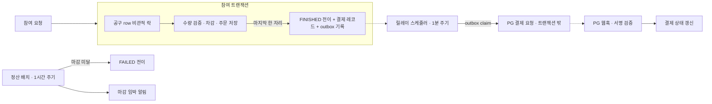

<p align="center">
  
</p>

# GoodsUp — 팬덤 굿즈 공동구매·마감 임박 결제 백엔드

목표 수량을 채운 공구만 결제하고, 마감 직전에 요청이 몰려도 참여 수량이 목표를 넘지 않게 하는 서비스다.

Java 21 · Spring Boot 3 · MySQL · JUnit5 · Testcontainers · jqwik

## 핵심 성과

- 동시 참여 200건(목표 수량 50)을 3회 반복해도 초과 판매 0건
- 재고 차감을 DB 비관적 락으로 처리했을 때 851 TPS, p99 148ms (로컬 Docker 기준). Redisson 락 대비 TPS 2.5배, p99 3.8배 낮다.
- 마감 정산 배치를 10회 동시 호출해도 상태 전이는 1회, 알림 중복은 0건

<p align="center">
  
</p>

## 아키텍처



- 공구를 만들면 `RECRUITING`이다. 마지막 한 자리가 차는 참여 트랜잭션에서 `FINISHED`가 되고, 결제 레코드와 outbox 기록이 같은 트랜잭션에 묶인다.
- 마감까지 못 채운 공구는 정산 배치가 `FAILED`로 바꾼다.
- 결제는 트랜잭션 밖에서 요청한다. 릴레이 스케줄러가 outbox를 읽어 PG를 호출하고, 결과는 웹훅으로도 받는다.
- 결제수단은 카드와 가상계좌다.

## 주요 기술적 결정

**공구 참여 동시성 제어** — DB 비관적 락 ([ADR-0001](docs/adr/0001-concurrency-control-strategy.md))
- 문제: 마감 직전에 몰리는 요청에서 재고가 목표를 넘으면 안 된다.
- 선택지: Redisson 락 / DB 비관적 락 / 낙관적 락 + 재시도
- 근거: 셋 다 초과 판매는 없었고, 처리량과 지연에서 DB 비관적 락이 가장 좋았다. Redis 없이 MySQL만으로 된다.
- 트레이드오프: 요청이 공구 row 락을 직렬로 기다린다. 락 대기 타임아웃은 200건 규모에서는 재현되지 않았지만 더 큰 규모는 확인하지 못했다.

**마감 정산 배치** — 단건 락 재사용 ([ADR-0002](docs/adr/0002-deadline-settlement-batch-concurrency.md))
- 선택지: 단건 비관적 락 재사용 / 벌크 UPDATE
- 근거: 정합성은 같았다. 벌크가 빠를 거라 예상했지만 테스트 실행 시간이 8~9배 길었다. 기존 락 패턴을 재사용하면 전이 대상도 정확히 알 수 있다.
- 트레이드오프: 벌크가 느린 원인은 확정하지 못했다. 조건에 맞는 인덱스가 없어 락 경합이 커졌을 가능성만 의심한다.

**결제 시점** — 목표 달성 후 결제 ([ADR-0003](docs/adr/0003-payment-timing-strategy.md))
- 선택지: 참여할 때 선결제 / 목표 달성 후 결제
- 근거: 미달 공구는 환불 자체가 없고, 참여 트랜잭션 안에서 PG를 호출하지 않는다.
- 트레이드오프: 결제가 실패한 참여자가 생기면 목표 수량을 못 채운 채 끝날 수 있다. 부분 실패 처리는 [ADR-0005](docs/adr/0005-partial-fanout-failure-refund-strategy.md)(초안)와 [ADR-0006](docs/adr/0006-pending-payment-state-and-timeout-policy.md)(부분 구현)에서 다룬다.

**결제 fan-out 트리거** — Outbox + 폴링 릴레이 ([ADR-0004](docs/adr/0004-payment-fanout-trigger-strategy.md))
- 선택지: 폴링 릴레이 / Debezium CDC 릴레이
- 근거: 폴링은 정합성 실측을 통과했고 신규 인프라가 필요 없다. CDC는 컨테이너로 띄워 커밋부터 Kafka 토픽 도착까지 p50 496ms를 확인했지만, 정합성과 장애 복구는 검증하지 못했고 Kafka 운영 부담이 있다.
- 트레이드오프: 트리거 지연이 스케줄러 주기(기본 1분)에 좌우된다. 이 값은 측정하지 않았다. 재시도 횟수와 lease 시간은 실측값과 정책 가정을 나눠 ADR에 적었다.

## 트러블슈팅

락 로직을 짤 때마다 Claude에게 깨뜨릴 시나리오를 뽑게 했고, 실제로 재현된 것만 고쳤다. ([전체 로그](docs/experiments/adversarial-test-log.md))

**워커 lease 만료 후 결제 중복 호출**
- 증상: lease가 만료돼 다른 워커가 같은 outbox row를 잡으면 같은 주문을 PG에 두 번 호출했고, 늦게 끝난 워커는 이미 처리된 row를 완료 처리하려다 예외를 던졌다.
- 해결: 완료 처리를 멱등하게 바꿨다. PG 중복 호출 자체는 idempotency key에 맡겼는데, 실제 PG 연동 전이라 검증은 안 됐다.

**끝난 공구에 마감 임박 알림 발송**
- 증상: 스케줄러가 대상을 조회한 뒤 알림을 보내기 전에 공구가 `FINISHED`나 `FAILED`가 되면 그대로 알림이 나갔다.
- 해결: 발송 시점에 공구 상태를 다시 조회해 `RECRUITING`이 아니면 보내지 않게 했다.

**1인당 구매 한도 누적 미검증**
- 증상: 검증이 이번 요청 수량만 한도와 비교해서, 같은 사용자가 한도만큼 두 번 참여하면 통과했다. 동시성이 아니라 순차 호출로도 재현됐다.
- 해결: 기존 참여 수량을 합산해서 검증한다. 이 조회도 공구 락 안에서 실행된다.

## 개발 방식

**테스트 전략**
- 동시 요청은 `ExecutorService`로 재현하는 통합 테스트로 확인한다(Testcontainers MySQL).
- "참여 수량은 목표를 넘지 않는다", "정산 후 상태는 되돌아가지 않는다" 같은 불변식은 jqwik property test로 본다.
- 재현된 반례는 회귀 테스트로 고정한다.

**AI 활용과 검증**
- 동시성·결제처럼 되돌리기 어려운 설계는 코드보다 ADR 초안을 먼저 쓰고 사람이 확인한 뒤 구현한다.
- 구현 뒤에는 Claude에게 깨뜨릴 시나리오를 만들게 하고, 재현된 것만 수정한다. 재현되지 않은 시나리오도 이유와 함께 남긴다. 위 버그 3건이 이 과정에서 나왔다.
- 결론의 근거는 Claude의 분석이 아니라 테스트 결과다. 테스트 코드 쪽 문제도 나왔다(지연 재현 테스트의 데드락, 전체 스위트에서만 실패하는 데이터 오염).
- 규칙은 [CLAUDE.md](CLAUDE.md)에 있고, 커밋 전 훅이 테스트를 돌리며 PR 템플릿에는 AI 활용 범위를 적는다.

## 실행 방법

MySQL 접속 정보는 `back/src/main/resources/application.properties`의 기본값(`localhost:3306/goodsup`, `user`/`0000`)을 쓴다.

```bash
docker run -d -p 3306:3306 -e MYSQL_ROOT_PASSWORD=root \
  -e MYSQL_DATABASE=goodsup -e MYSQL_USER=user -e MYSQL_PASSWORD=0000 mysql:8.0

cd back
./gradlew bootRun
./gradlew test    # Docker 필요 (Testcontainers)
```

API 문서는 실행 후 Swagger UI(springdoc)에서 볼 수 있다. 웹훅 서명 키는 환경변수 `PG_WEBHOOK_SECRET`이고, 없으면 로컬용 기본값을 쓴다.

## 한계와 다음 단계

**한계**
- PG는 `LoggingPgPaymentGateway` 플레이스홀더라 실제 응답 지연과 타임아웃을 측정하지 못했다.
- 수치는 로컬 Docker 단일 인스턴스 기준이다. 더 큰 규모의 락 대기는 확인하지 못했다.
- 배송 상태(`DeliveryStatus`)는 초기값만 있고 전이 코드가 없다.

**다음 단계**
- 가상계좌 입금 기한과 실패 사유별 재시도 구분 구현 (ADR-0006 축 3·5)
- 결제 부분 실패 시 취소·환불 (ADR-0005)
- 실제 PG 샌드박스 연동 후 재시도·lease 상수 재검증
- 정산 벌크 UPDATE가 느린 원인 확인 (`EXPLAIN` 분석)
