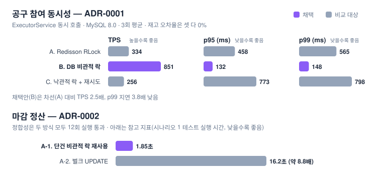

<p align="center">
  
</p>

<p align="center"><em>마감 시각에 몰리는 결제 요청에도, 목표 수량을 절대 넘기지 않는다.</em></p>

<p align="center">
  
  
  
  
</p>

<p align="center">
  
</p>

* * *

팬덤 굿즈 공동구매 서비스의 백엔드입니다. 목표 수량이 다 찬 공구만 결제가 진행되고, 못 채우면 결제 없이 끝납니다.
마감 직전에 몰리는 동시 참여 요청에서 수량이 목표를 넘지 않게 하는 것이 가장 신경 쓴 부분이라, 락 전략 같은
결정은 직접 돌려본 수치와 반례 테스트를 근거로 골랐고 그 과정을 `docs/`에 남겼습니다.

## 서비스 흐름

1. 공구를 만든다. 굿즈, 목표 수량, 마감 시각을 정하고 상태는 `RECRUITING`이다.
2. 사용자가 수량과 결제수단(카드, 가상계좌)을 골라 참여한다. 이때는 결제하지 않고 수량만 확보한다.
3. 마지막 한 자리가 차는 순간 그 참여 트랜잭션에서 공구가 `FINISHED`가 된다.
4. 마감 시각까지 못 채운 공구는 정산 배치가 `FAILED`로 바꾼다. 마감 임박 공구에는 알림도 이 배치에서 보낸다.
5. `FINISHED`가 되면 참여자 전원에게 결제 요청을 보낸다. PG 응답은 웹훅으로도 받는다.

| API | 설명 |
|---|---|
| `POST /api/goods-fundings` | 공구 개설 |
| `POST /api/goods-fundings/{id}/orders` | 공구 참여 (재고 차감) |
| `GET /api/orders/{orderId}/payment` | 결제 상태 조회 |
| `POST /api/payments/webhook` | PG 결제 결과 수신 (HMAC-SHA256 서명 검증) |

나머지 API는 실행 후 Swagger UI(springdoc)에서 볼 수 있습니다.

## 동시성 전략은 어떻게 골랐나

위 그래프가 실측 결과입니다. 재고 차감은 Redisson 락, DB 비관적 락, 낙관적 락 세 가지를 같은 조건에서
돌려 봤고, 정합성은 모두 문제가 없어서 처리량과 지연이 가장 좋았던 DB 비관적 락으로 정했습니다. Redis 없이
MySQL만으로 되는 점도 이유입니다. ([ADR-0001](docs/adr/0001-concurrency-control-strategy.md))

마감 정산은 단건 락 재사용과 벌크 UPDATE를 비교했습니다. 벌크가 더 빠를 거라 예상했는데 오히려 8~9배 느려서
기존 락 방식을 그대로 썼습니다. ([ADR-0002](docs/adr/0002-deadline-settlement-batch-concurrency.md))

결제를 시작하는 방식도 비슷하게 봤습니다. 정산 후 결제 요청은 outbox 테이블에 기록해 두고 스케줄러가 읽어 처리하는
폴링 방식으로 정했습니다. Debezium으로 CDC를 붙이는 안도 컨테이너로 띄워 봤는데, 커밋부터 Kafka 토픽 도착까지
p50 496ms 정도였습니다. 이 서비스에서 결제 시작이 그 정도로 빠를 필요는 없다고 보고, Kafka 운영 부담을 지지 않는
쪽을 택했습니다. ([ADR-0004](docs/adr/0004-payment-fanout-trigger-strategy.md))

## 테스트

- 동시 요청은 `ExecutorService`로 재현하는 통합 테스트로 확인합니다 (Testcontainers MySQL).
- "참여 수량은 목표를 넘지 않는다", "정산 후 상태는 되돌아가지 않는다" 같은 불변식은 jqwik property test로 봅니다.
- 락이나 결제 로직을 짠 뒤에는 Claude에게 일부러 깨뜨릴 방법을 찾게 하고, 실제로 재현된 것만 수정한 뒤
  기록했습니다. 재현 안 된 시나리오도 이유와 함께 남겼습니다. ([적대적 테스트 로그](docs/experiments/adversarial-test-log.md))

## 결제 처리

- 참여 트랜잭션 안에서는 PG를 호출하지 않습니다. 결제는 목표 달성 이후에만 하기 때문에 미달 공구는 환불할 일이 없습니다. ([ADR-0003](docs/adr/0003-payment-timing-strategy.md))
- 재시도 횟수, 워커 lease 시간 같은 상수는 실측값과 정책 가정을 나눠서 [ADR-0004](docs/adr/0004-payment-fanout-trigger-strategy.md)에 근거를 적었습니다.

## 설계 결정 (ADR)

| # | 주제 | 상태 |
|---|---|---|
| [0001](docs/adr/0001-concurrency-control-strategy.md) | 공구 참여 동시성 제어 | 채택 |
| [0002](docs/adr/0002-deadline-settlement-batch-concurrency.md) | 마감 정산 배치 동시성 | 채택 |
| [0003](docs/adr/0003-payment-timing-strategy.md) | 결제 시점 (목표 달성 후 결제) | 채택 |
| [0004](docs/adr/0004-payment-fanout-trigger-strategy.md) | 결제 fan-out 트리거 | 채택 |
| [0005](docs/adr/0005-partial-fanout-failure-refund-strategy.md) | 부분 실패 환불 | 초안 |
| [0006](docs/adr/0006-pending-payment-state-and-timeout-policy.md) | PENDING 상태·타임아웃 | 부분 구현 |

## 구조

```
back/src/main/java/com/goodsup/demo
├── goods         공구 도메인
├── orders        참여·주문
├── payment       결제 fan-out, PG 웹훅 (HMAC-SHA256 서명 검증)
├── notification  마감 임박 알림
├── user
└── common        ApiResponse, GlobalExceptionHandler
```

Controller → Service → Repository 3계층. 트랜잭션은 Service에서만, 재고 로직은 반드시 락으로 보호.
전체 규칙은 [CLAUDE.md](CLAUDE.md).

## 실행

```bash
cd back
./gradlew test    # Docker 필요 (Testcontainers)
```

## 기술 스택

Spring Boot 3.x · Java 21 · MySQL · Spring Data JPA · Spring Security · springdoc · JUnit5 · Testcontainers · jqwik
